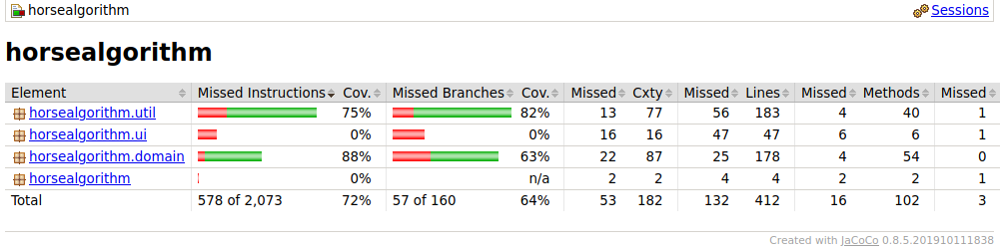

# Testing document
    
## What has been tested and how

The application is unit tested by JUnit.

Picture: Jacoco test report

UI class and main class is not unit tested and this is seen in jacoco test report also. For util package the unit test coverage is 75% and for the domain package coverage is 88%.

The performance of the application is tested in the class called "Tester.java". The performance tests use Java function System.nanotime() to measure the duration of opertaion of the algorithms. The Gale-Shapley algorithm is tested 50 times with parameters of 10, 100, 1 000, 10 000, 100 000 and 1 000 000 horses and riders each. Then the average of these runs is calculated to determine the performance of the algorithm. The brute force algorithm is tested also 50 times and the parameters are 1, 10, 100 and 1 000 horses and riders each. Again the average of these runs is calculated to determine the performance of the brute force algorithm.

## What types of input were used in tests

The input for the Gale-Shapely algorithm is generated using the HorseFactory and RiderFactory classes. With these classes given number of riders and horses are generated and then given to the algorithm for processing. The test input is not equal to the programs actual use case because if it were the real use case then the horses and riders should be paired before running the Gale Shapleys algorithm. This should be done because pairing sets the rider's favorite horses and that is used to evaluate the goodness of the some given horse and the rider.

In brute force performance test randomly generated horses and riders are first paired using the PairFactory class and then each pairs' score is calculated. The tested part is the pair's score calculation, the pairign in of the pairs in PairFactory class is not measured.

## How can the tests be repeated

When the application is build with command line command "gradle build" or "./gradlew build then the unit tests of the application can be executed from the command line with command "gradle test" or "./gradlew test".

The performance test of the application can be repeated by starting the application from the command line with command "gradle run" or "./gradlew run". Then after providing the amount of horses and riders from the user interface can be selected the option "5". This command runs the performance tests. 

## Results of empirical testing presented in graphical form

!()[img/1.png "Gale Shapley algorithm"]

!()[img/2.png "Brute force"]
    
